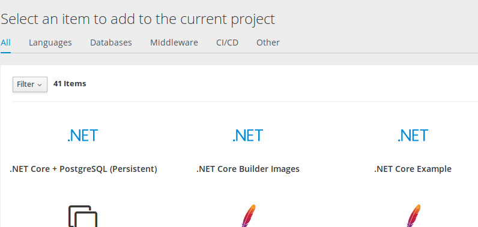
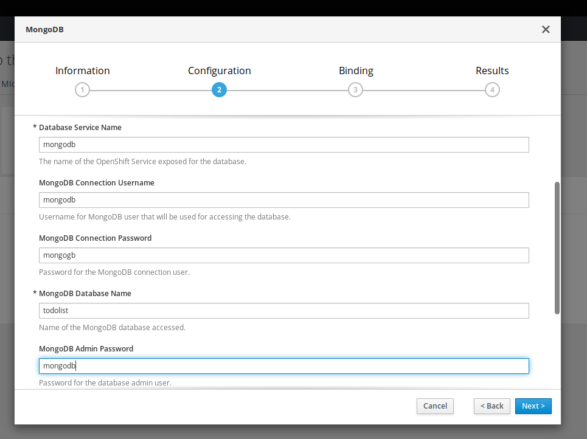

# Manawa Workshops

* SCM             : github (https://github.com/adeo/manawa-workshops.git)
* Manawa            : https://manawa.euw1-gcp-poc.adeo.cloud/console/


## Prerequisite :

You will need the oc cli (Openshift Command Line Interface) installed on your laptop to initialize your Openshift project.

You can find the instructions to install it bellow. 
* For Windows: https://blog.openshift.com/installing-oc-tools-windows/
* For OS X: 
  * Option 1: 
  
  If you have Homebrew (https://brew.sh/) installed:

  Open a new terminal and enter this command: 
  `brew install openshift-cli`
  * Option 2:
  
  Open a new terminal and enter the following commands.
  ```
  wget https://github.com/openshift/origin/releases/download/v3.10.0-rc.0/openshift-origin-client-tools-v3.10.0-rc.0-c20e215-mac.zip

  unzip -a openshift-origin-client-tools-v3.10.0-rc.0-c20e215-mac.zip
  
  mv ./oc /usr/local/bin/
  ```


* For Linux:  
```
wget https://github.com/openshift/origin/releases/download/v3.10.0-rc.0/openshift-origin-client-tools-v3.10.0-rc.0-c20e215-linux-64bit.tar.gz

tar -xvzf openshift-origin-client-tools-v3.10.0-rc.0-c20e215-linux-64bit.tar.gz

mv openshift-origin-client-tools-v3.10.0-rc.0-c20e215-linux-64bit/oc /usr/local/bin
```


## Step 1 : Clone workshop-manawa-advanced from Github repo
1. git clone https://github.com/adeo/manawa-advanced-workshop.git
```
$ git clone https://github.com/adeo/manawa-advanced-workshop.git
```


## Step 3 : Create your project 

* Create a project in Manawa and a Manawa build config

> Please name your project like this: devweek-<your_ldap_id>-todolist (e.g. 'devweek-2000xxxx-todolist)

```
oc login -u <YOUR LDAP ID> https://manawa.euw1-gcp-poc.adeo.cloud/
oc new-project devweek-<your_ldap_id>-todolist
```


## Step 4 : Create MongoDB  

1. Connect to Web Console 
* Point your browser to https://manawa.euw1-gcp-poc.adeo.cloud/ and login with ldap/password

2. Install MongoDB
* From "Browse Catalog" 


* select "databases"



* then "MonogDB" 


* On second screen, You must fill in the following fields :

> * Database Service Name : mongodb
> * MongoDB Connection Username : mongodbuser
> * MongoDB Connection Password : mongodbpass
> * MongoDB Database Name : todolist
> * MongoDB Admin Password : *********



## Deploy frontend application

```
$ oc create -f todo.yaml 
imagestream "manawa-todo" created
deploymentconfig "manawa-todo" create
```

## Connect my Frontend application to Database

```
$ oc set env dc/manawa-todo -e MONGODB_USER=mongodbuser -e MONGODB_PASSWORD=mongodbpass -e MONGODB_DATABASE=todolist -e DATABASE_SERVICE_NAME=mongodb.devweek-<LDAP>-todolist.svc
```

## Expose my application to internal cluster with Private IP

1. expose the service to internal cluster
```
$ oc create -f service.yml 
service "manawa-todo-service" created
```

## Expose my application to everyone with Public IP

1. get the service to expose:

```
$ oc get svc
NAME          CLUSTER-IP      EXTERNAL-IP   PORT(S)     AGE
manawa-todo-service   172.30.62.149   <none>        8080/TCP    25s
mongodb       172.30.178.29   <none>        27017/TCP   4h
```

2. create the route
```
$ oc create route edge --service manawa-todo-service --port 8080
or 
$ oc create –f route.yaml
```


3. Finaly, check:
```
$ oc get routes
```

> * Now test your application on https://manawa-todo-devweek-<YOUR LDAP ID>-todolist.euw1-gcp-poc.adeo.cloud
> * Normaly connection to database failed... 

## Connect my Frontend application to Database

```
$ oc set env dc/manawa-todo -e MONGODB_USER=mongodbuser -e MONGODB_PASSWORD=mongodbpass -e MONGODB_DATABASE=todolist -e DATABASE_SERVICE_NAME=mongodb.devweek-<LDAP>-todolist.svc
```


## Autoscale my application
1. Set CPU and Memory limits on your deployment:
```
$ oc set resources dc manawa-todo --limits=cpu=200m,memory=512Mi --requests=cpu=100m,memory=256Mi
```

2. Then, configure the auto-scaling:
```
$ oc autoscale dc manawa-todo --min 1 --max 10 --cpu-percent=80
```

3. Check :
```
$ oc get hpa
```

4. Finally, launch an ab testing:
```
$ ab -n 10000 -c 20 https://manawa-todo-devweek-<LDAP>-todolist.euw1-gcp-poc.adeo.cloud/tasks
```

5. And now check hpa and pods:
```
$ oc get hpa && oc get po && oc get dc
```

## Change my application release (rolling update)


1. Change imageStream manually :
```
$ oc tag quay.io/adeo/manawa-todo:v2 manawa-todo:latest
```

Also, you replace the existing image tag by a new one (remote).


2. Check :
```
$ oc rollout status  dc/manawa-todo
$ oc get dc
```

* Finally, check your new application release !:
https://manawa-todo-devweek-<LDAP>-todolist.euw1-gcp-poc.adeo.cloud

## Manage my application (log, rsh, debug)

1. Check logs:
```
$ oc get po
$ oc logs po/XXX
```


2. Go inside your pod:
```
$ oc rsh po/XXX
```


3. Test those commands: 
```
$ oc describe <something>
$ oc export <something>
$ oc whoami –c|-t
$ oc get pv
$ oc get pvc
...
```

## Remove my database

1. Delete your mongo database and check what is going on !
```
$ oc get pods
$ oc delete po/mongodb-X-XXXX
```
